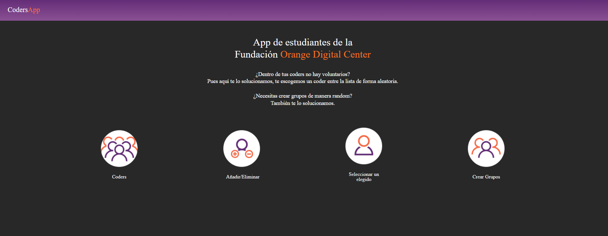
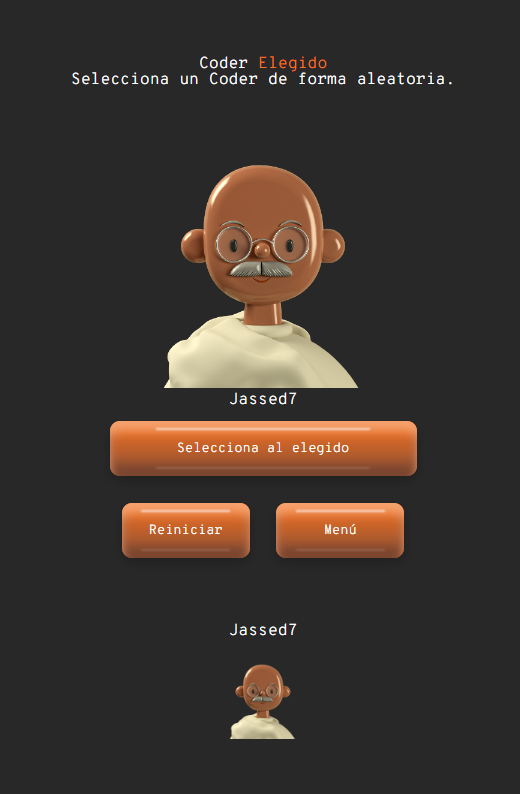
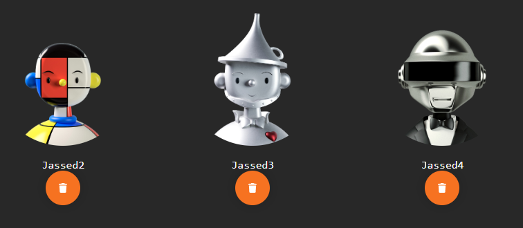

# CodersApp

## Descripción

**Coders APP** es una sencilla aplicación web que te permite seleccionar de forma aleatoria un alumno entre todos los que hay en la clase. Además, la aplicación ofrece la funcionalidad de añadir o eliminar alumnos según sea necesario.

## Características

- Selección aleatoria de un alumno de la lista.
- Añadir nuevos alumnos a la lista.
- Eliminar alumnos existentes de la lista.

## Figma

Visita nuestro Figma

https://www.figma.com/file/8FIyZCdUK5R0c2BAPHga65/Py_CodersApp?type=design&node-id=56%3A7&mode=design&t=RxNrG28knuN3Ujuy-1

## Tecnologías

## Capturas de pantalla

*Interfaz principal para seleccionar un alumno aleatorio.*

*Interfaz para añadir un nuevo alumno a la lista.*

*Interfaz para eliminar un alumno de la lista.*

## Instrucciones de uso

1. Abre el archivo "index.html" en tu navegador web preferido.
2. Para seleccionar un alumno aleatorio, haz clic en el botón "Seleccionar Alumno".
3. Si deseas añadir un nuevo alumno, haz clic en el enlace "Añadir Alumno" y completa los datos solicitados en el formulario.
4. Si deseas eliminar un alumno existente, haz clic en el enlace "Eliminar Alumno" junto al nombre del alumno que deseas eliminar.

## Contribución

Si deseas contribuir a este proyecto, puedes hacerlo abriendo un "Pull Request" en la rama "rama-random". Agradecemos mucho cualquier mejora, corrección de errores o nuevas funcionalidades que puedas aportar.

¡Gracias por tu interés en la Random Student Selector App! Si tienes alguna pregunta o comentario, no dudes en comunicarte con nosotros.

*Nota: Las capturas de pantalla y archivos mencionados en este README son hipotéticos y deben ser reemplazados por los reales correspondientes al proyecto.*

## Próximamente

Se podrán hacer grupos de forma aleatoria insertando el número de grupos necesarios para la actividad.

